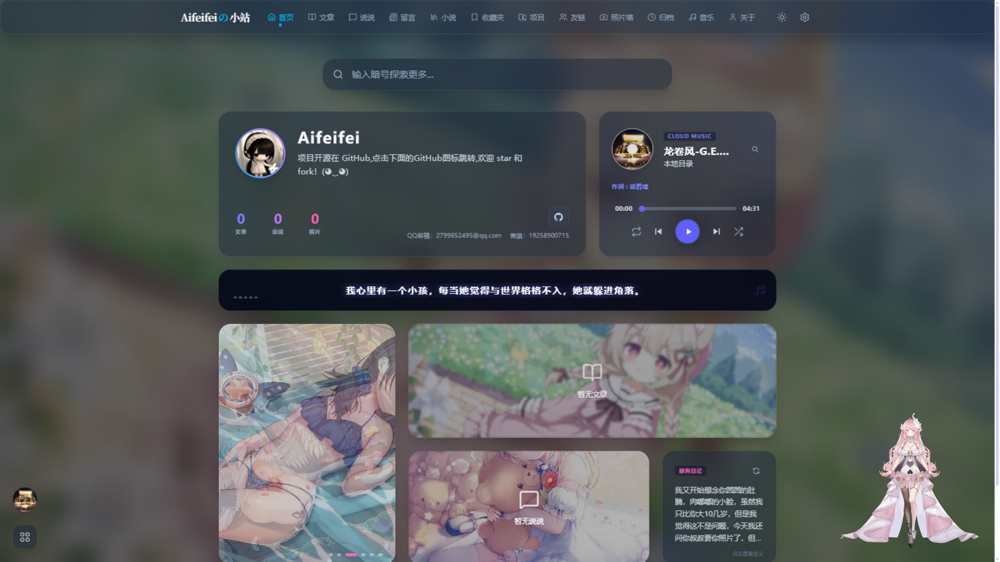
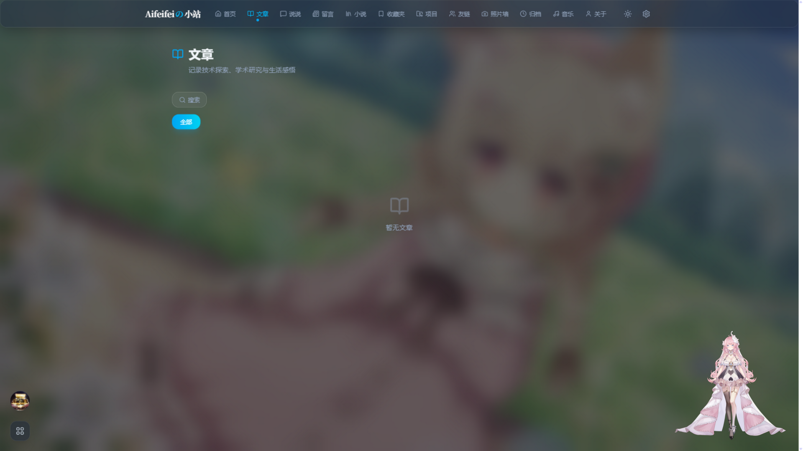
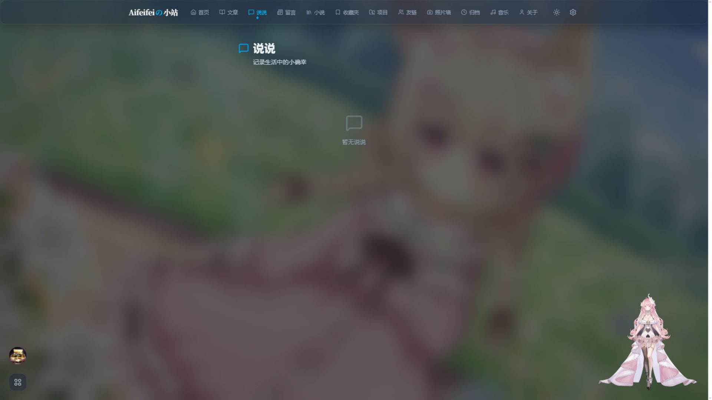
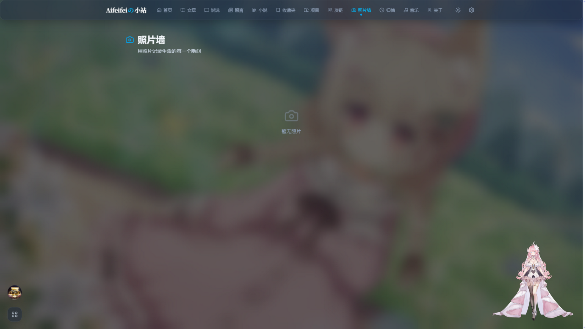
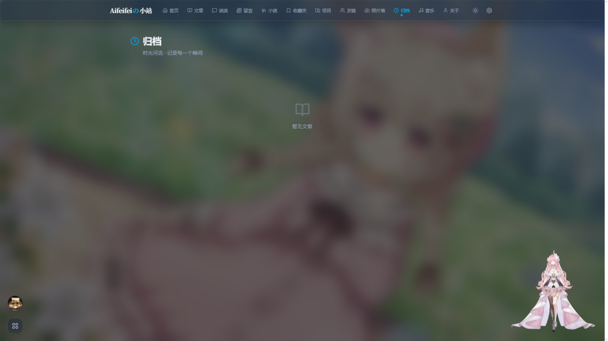

<div align="center">

# Fly

**きらめく —— 像星光一样闪烁**

一个从零开始写的全栈个人博客。
Next.js 前台 · Spring Boot 后台 · Vue 管理端 · 内置小说阅读器 · 一整个百草园工具箱 · Docker Compose 一条命令拉起。


</div>

---

## 它长什么样

<div align="center">
  
  
  
  
  
</div>

## 这不是一个"文章系统"而已

**博客该有的都有** —— Markdown 文章（分类、标签、代码高亮）、说说、留言、照片墙、收藏夹、
项目展示、归档时间线、音乐播放器（云歌单 + 本地曲库扫描）、漂流瓶友链、RSS 全文订阅。

**百草园 `/garden`** —— 一个越写越大的玩具箱，首页是全站数据看板（运行天数、发文趋势、分类占比），
后面藏着 18 个即开即玩的小东西：three.js 太阳系、八种排序算法可视化、康威生命游戏、
Jos Stam 流体模拟、流沙与烟花、函数绘图、Markdown 编辑器、Python/JSON 编辑器、
二维码生成、万花筒画板、城市地图、小屋设计器……

**小说阅读器 `/novel`** —— 书架 → 搜索 → 目录 → 阅读，四级路由完整闭环。
后端内置 reader3 协议：SSE 流式搜索、正文服务端解码清洗（无广告弹窗）、
阅读进度全局记忆。数据源为免费小说站，无付费章节。

**两套管理端** —— 对外的 `/admin`（Next.js）：管理员登录、内容审核、书架管理、站点配置；
内嵌的 Vue 3 全功能后台：文章/分类/标签/评论/说说/相册/项目/友链/收藏夹全量 CRUD、
图片压缩上传阿里云 OSS，只绑 `127.0.0.1` 不暴露公网。访客统计（IP/UA/归属地/代理识别）
与异常日志开箱即用。

## 技术栈

- **前台** Next.js 16（App Router，SSR/SSG）· React 19 · Tailwind CSS 4 · TypeScript 5 · Framer Motion · three.js · CodeMirror 6 · pixi-live2d-display（看板娘）
- **后台** Spring Boot 3.3 · JDK 21 · Spring Data JPA · PostgreSQL 16 · JWT（jjwt）· 阿里云 OSS（可选）
- **管理端** Vue 3 · Element Plus（vue-pure-admin），构建产物内嵌于后端镜像
- **部署** Docker Compose 四服务编排 · Nginx（HTTPS 终结 + 限流）· acme.sh 证书自动续签

## 跑起来

```bash
git clone https://github.com/hkxykx/Aifeifei.git
cd Aifeifei

cp .env.example .env
# 填 4 项（都有注释说明）：
#   POSTGRES_PASSWORD        数据库密码
#   ADMIN_INITIAL_PASSWORD   管理员初始密码（必填，无默认值）
#   FLY_SECRET_KEY           JWT 密钥，openssl rand -hex 32
#   FLY_CORS_ORIGINS         必须包含线上域名

docker compose up -d --build
```

- 博客前台：<http://localhost/>
- 管理后台：<http://localhost/admin>（用户名 `feifei`）

上生产只多两步：证书 `fullchain.pem` / `privkey.pem` 放进 `deploy/certs/`，
把 `deploy/nginx.conf` 的 `server_name` 改成你的域名。

本地开发：

```bash
# 前端 → http://localhost:3000
cd fly && pnpm install && pnpm dev

# 后端 → http://localhost:8000（需本地 PostgreSQL，先执行 fly-backend/init_db.sql）
cd fly-backend && mvn spring-boot:run
```

更多路径：[Docker 部署](docs/Docker部署.md) · [传统部署](docs/传统部署.md) · [运维手册](docs/运维手册.md)（从裸机到上线的完整手册，含备份、回滚、证书续签）

## 目录结构

```
fly/            前端
├── app/          14 个路由 + API 封装（posts novel garden moments messages
│                 bookmark photowall friends timeline music projects about admin feed）
├── components/   UI 组件（layout ui widgets music photos …）
├── content/      本地 Markdown 文章
├── data/         站点初始数据
├── public/       静态资源 + Live2D 模型
└── siteConfig.ts 全站配置中心

fly-backend/    后端
├── src/main/java/com/fly/
│     controller/ service/ repository/ entity/ security/ config/
├── admin/        Vue 管理后台（构建产物内嵌后端镜像）
├── init_db.sql   建表脚本（19 张表，不含数据、不含账号）
└── init_admin.sh 管理员账号初始化（密码必填，无默认值）

deploy/         nginx.conf + HTTPS 证书目录（私钥永不入库）
docs/           三份部署文档 + README 截图
```

## 几个设计决定

- **仓库里不存在任何默认凭证**。管理员密码、JWT 密钥缺失时服务直接拒绝启动——公开仓库 ≠ 公开后台。
- **Nginx 是唯一的闸门**：通用 API 30 r/s、登录 1 r/s 防爆破、音乐与小说源独立配额；
  `X-Forwarded-For` 由 Nginx 覆写，客户端伪造不了来源 IP。
- **上传走白名单 + nosniff**，避免图片被当 HTML/SVG 执行；Vue 后台不进公网。
- **CORS 白名单必须包含线上域名**——浏览器同源 POST 也会带 `Origin` 头，这一条踩过坑的人都会写进注释。
- 看板娘右下角常驻；连点 Logo 7 次有彩蛋。

## License

[MIT](LICENSE) · 原作 © 2024 孤鸿 · 二次开发 © 2026 Aifeifei
